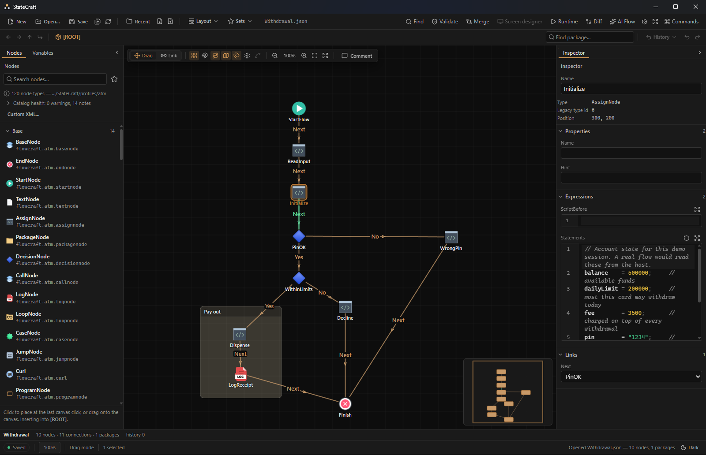
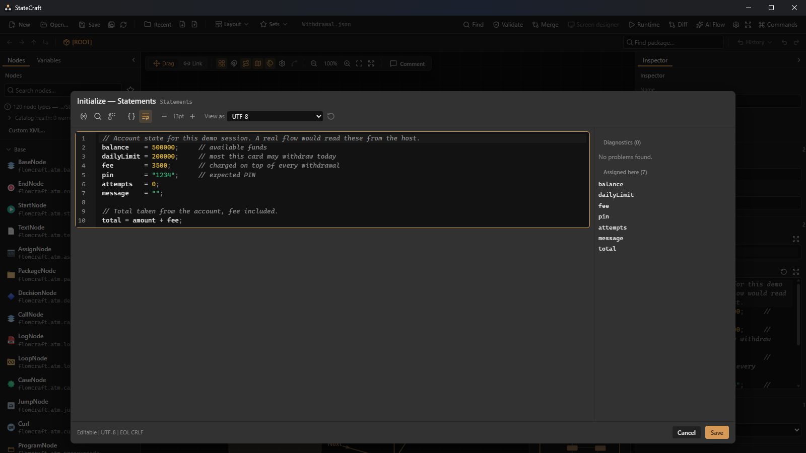
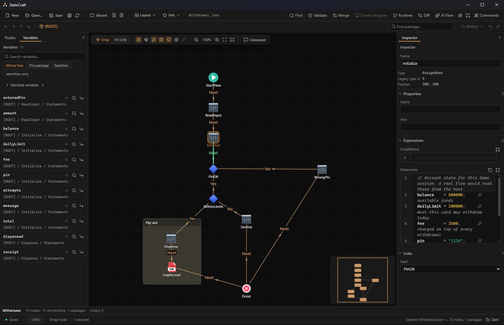
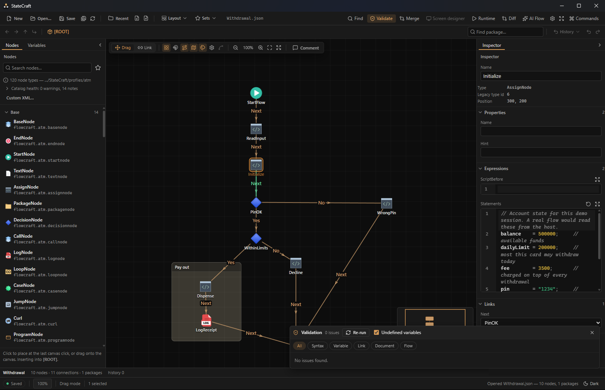
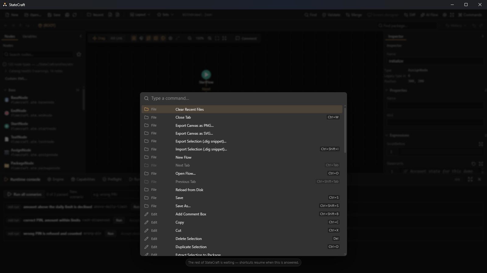
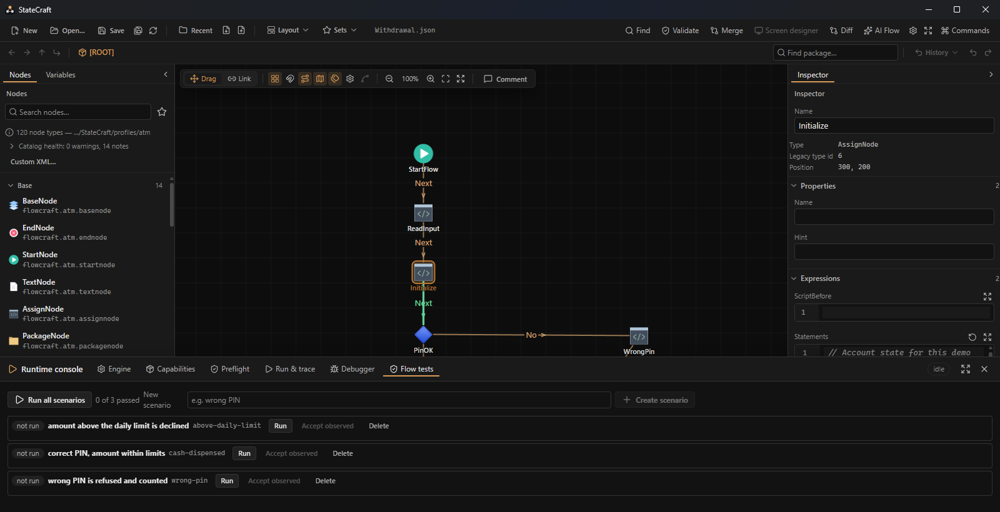

# StateCraft

**A general-purpose desktop visual flow editor** — design, script, validate, run, debug and test a
flow in one place. Load a profile with the right nodes and it fits the domain: ATM and kiosk flows
are one use case, not the limit.

> This repository is a **showcase only**: screenshots and a feature tour. The product itself is
> proprietary and its source is not published here.

## Highlights

- **Profile-driven** — node types, functions and validation rules come from the profile you load,
  so the editor is not tied to any one industry.
- **Visual canvas** — floating-icon nodes, route points, comment boxes, minimap, marquee selection,
  snapping, and undo/redo. Open several flows as tabs, each with its own history.
- **Real scripting** — a CodeMirror-based script editor with completion and live diagnostics driven
  by the loaded profile's function catalog.
- **Whole-flow analysis** — unreachable nodes, unknown ports, type mismatches, and variables read on
  paths that never set them, shown as badges on the canvas.
- **Run and debug** — run, step, breakpoints, typed variables, starting inputs and device simulation.
- **Flow Tests** — saved scenarios with inputs, scripted screen answers and expected outcome, path
  and variables; run one or all, and accept the observed result as the new expectation.
- **Refactoring** — find references and safe rename for variables; extract a selection into a
  package, or inline one.
- **Legacy-compatible** — opens and saves existing `.dig` / `.dml` flows with a byte-exact round-trip.
- **Screen designer** — 30 element types, motion, gradients, fonts, and imported React screens.
- **Git-friendly flows** — a split-JSON format with semantic three-way merge and per-node blame, so
  two people can edit one flow.
- **Safe by default** — Ctrl+S from any focus, per-flow crash recovery, and secrets kept in the OS
  credential store.
- **Native Windows app** — small installer, per-user install, no console window, no admin prompt.

## A tour

All screenshots show a sample cash-withdrawal flow (an ATM profile) whose Assign nodes carry real
multi-line scripts — just one of the domains the editor can host.

### The script editor
Syntax highlighting, live diagnostics, and the list of variables the script assigns.

### Variables
Every variable the flow assigns, and the node and field that assigns it, with search, scope filters
and jump-to-definition.

### Validation
Profile-driven rules with a Rules panel and badges on the canvas nodes.

### Command palette
Everything in the app, one `Ctrl+K` away.

### Flow Tests
Scenarios saved beside the project, each run on the real engine.

## Interested?

StateCraft is not open source and is not distributed freely. For a demo, licensing or any other
question, contact **AMIRSRAD** through [GitHub](https://github.com/AMIRSRAD).

---

© 2026 AMIRSRAD. All rights reserved. The screenshots and text in this repository may not be
copied, redistributed or used to build a competing product without written permission.
